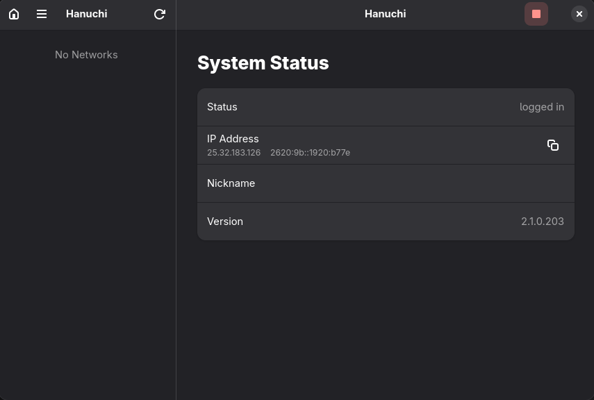

# Hanuchi

**Minimalist GTK4/Libadwaita frontend for LogMeIn Hamachi.**



Hanuchi is a lightweight, utility-first GUI for managing LogMeIn Hamachi networks on Linux.
Designed for modern GNOME environments (Wayland supported), strictly following the philosophy of keeping the tool clean, native, and bloat-free.

No ads. No political banners. No legacy dependencies. Just network management.

## Features
* **Native Experience:** Written in Python using GTK4 and Libadwaita.
* **Context-Aware:** Smart actions ("Leave" for members, "Delete" for owners).
* **System Integration:** Controls the `logmein-hamachi` systemd service automatically via PolicyKit.
* **Localization:** English / Russian (Auto-detected).
* **Clipboard Ready:** Click any field (IP, ID) to copy.

## Requirements
* Python 3.10+
* `logmein-hamachi` (installed and configured)
* `gtk4`, `libadwaita`, `python-gobject`

## Installation

### Arch Linux / CachyOS / Manjaro
You can install Hanuchi using the included `PKGBUILD`:

```bash
cd pkg/
makepkg -si
```

### Other Distributions (Ubuntu, Fedora, Debian)
Use the universal installer script (requires root):

```bash
sudo ./install.sh
```

### Manual Installation
1. Copy `hanuchi` to `/usr/bin/` and make it executable.
2. Copy `hanuchi.desktop` to `/usr/share/applications/`.

## License
MIT License.
