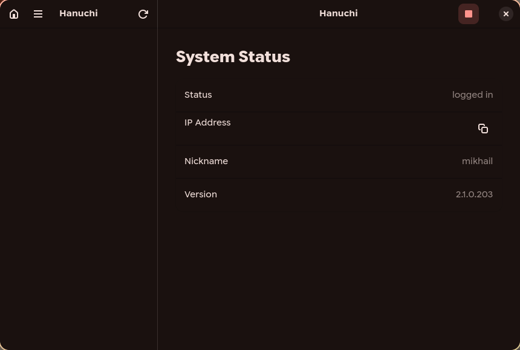

# Hanuchi

**Minimalist GTK4/Libadwaita frontend for LogMeIn Hamachi.**



Hanuchi is a lightweight, utility-first GUI for managing LogMeIn Hamachi networks on Linux.
Designed for modern GNOME environments (Wayland supported), strictly following the philosophy of keeping the tool clean, native, and bloat-free.

## Features
* **Native Experience:** Written in Python using GTK4 and Libadwaita.
* **System Integration:** Controls the `logmein-hamachi` systemd service automatically via PolicyKit.
* **Zero-config Setup:** Automatically starts the daemon and registers your node with Hamachi on first launch — no terminal required.
* **Localization:** English / Russian

## Requirements
* Python 3.10+
* `logmein-hamachi` (installed and configured)
* `gtk4`, `libadwaita` (>= 1.2), `python-gobject`
* `meson`, `ninja` (build-time only)

## Installation

### Arch Linux / CachyOS / Manjaro
You can install Hanuchi using the included `PKGBUILD`:

```bash
cd pkg/
makepkg -si
```

Also you can install Hanuchi from AUR using Yay:

```bash
yay -S hanuchi
```

### Other Distributions (Ubuntu, Fedora, Debian)
Hanuchi uses the [Meson](https://mesonbuild.com/) build system. Clone the repository and build:

```bash
git clone https://github.com/Advnirr/hanuchi.git
cd hanuchi
meson setup build --prefix=/usr
ninja -C build
sudo ninja -C build install
```

## Removal

### Arch Based Distributions
Remove using the pacman package manager.

```bash
sudo pacman -R hanuchi
```

### Other Distributions
From the build directory created during installation:

```bash
sudo ninja -C build uninstall
```

## Support

If Hanuchi made Hamachi on Linux less painful, you can support continued
development directly:

**USDT** · TON network

```
UQDFela8stCZykNL2cLw2erPkzjAgSf-GLXoJuiTEmEckTNB
```

## License
MIT License.
